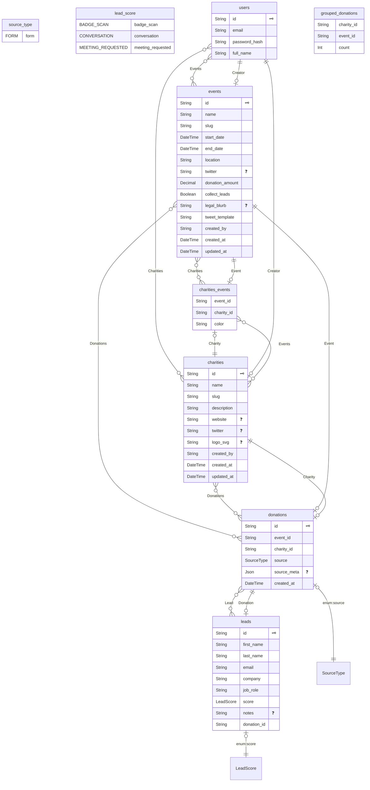

```mermaid
erDiagram

        source_type {
            FORM form
        }
    


        lead_score {
            BADGE_SCAN badge_scan
CONVERSATION conversation
MEETING_REQUESTED meeting_requested
        }
    
  "users" {
    String id "🗝️"
    String email 
    String password_hash 
    String full_name 
    }
  

  "events" {
    String id "🗝️"
    String name 
    String slug 
    DateTime start_date 
    DateTime end_date 
    String location 
    String twitter "❓"
    Decimal donation_amount 
    Boolean collect_leads 
    String legal_blurb "❓"
    String tweet_template 
    String created_by 
    DateTime created_at 
    DateTime updated_at 
    }
  

  "charities" {
    String id "🗝️"
    String name 
    String slug 
    String description 
    String website "❓"
    String twitter "❓"
    String logo_svg "❓"
    String created_by 
    DateTime created_at 
    DateTime updated_at 
    }
  

  "charities_events" {
    String event_id 
    String charity_id 
    String color 
    }
  

  "donations" {
    String id "🗝️"
    String event_id 
    String charity_id 
    SourceType source 
    Json source_meta "❓"
    DateTime created_at 
    }
  

  "leads" {
    String id "🗝️"
    String first_name 
    String last_name 
    String email 
    String company 
    String job_role 
    LeadScore score 
    String notes "❓"
    String donation_id 
    }
  

  "grouped_donations" {
    String charity_id 
    String event_id 
    Int count 
    }
  
    "users" o{--}o "events" : "Events"
    "users" o{--}o "charities" : "Charities"
    "events" o|--|| "users" : "Creator"
    "events" o{--}o "charities_events" : "Charities"
    "events" o{--}o "donations" : "Donations"
    "charities" o|--|| "users" : "Creator"
    "charities" o{--}o "charities_events" : "Events"
    "charities" o{--}o "donations" : "Donations"
    "charities_events" o|--|| "events" : "Event"
    "charities_events" o|--|| "charities" : "Charity"
    "donations" o|--|| "SourceType" : "enum:source"
    "donations" o{--}o "leads" : "Lead"
    "donations" o|--|| "events" : "Event"
    "donations" o|--|| "charities" : "Charity"
    "leads" o|--|| "LeadScore" : "enum:score"
    "leads" o|--|| "donations" : "Donation"
```
